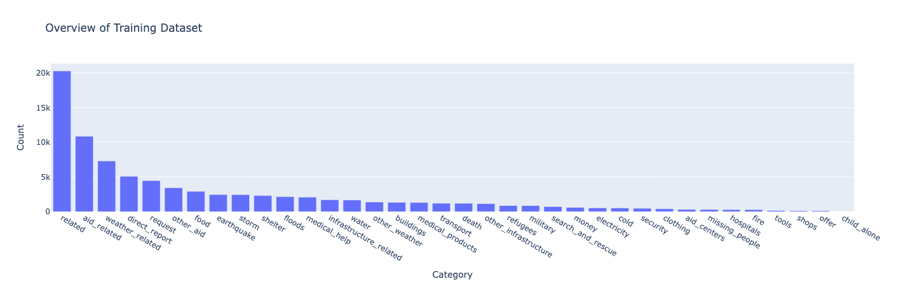
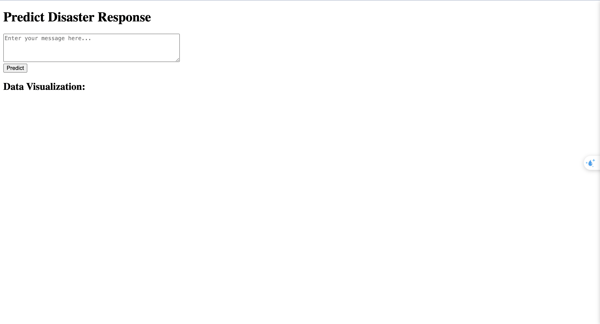
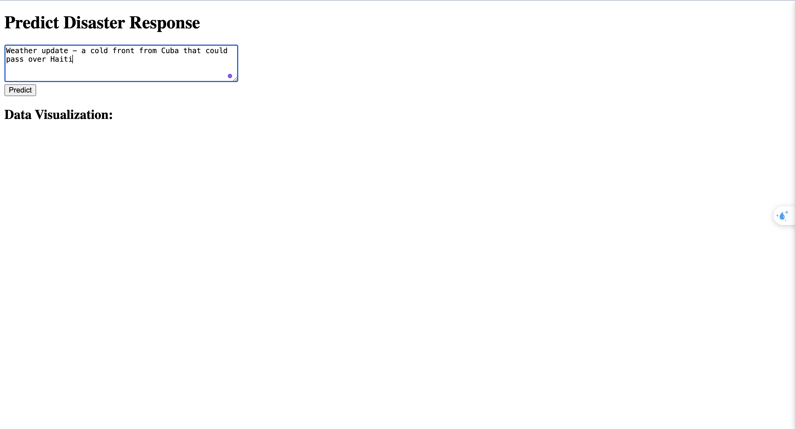
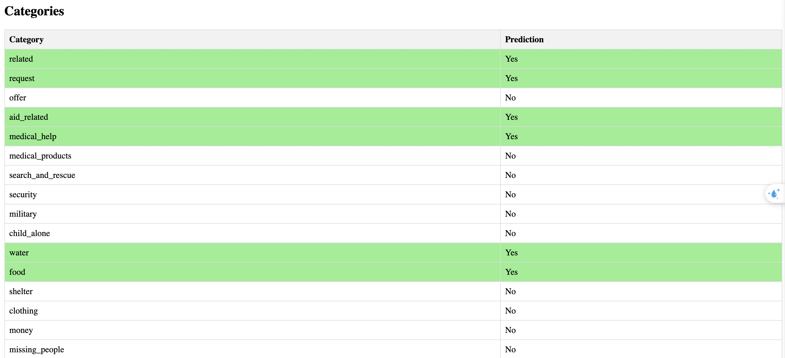

# Disater Response 

## Introduction
Currently, due to abnormal weather changes, natural disasters are increasing. Therefore, developing a system for quickly responding to and coordinating relief activities is extremely necessary. “Disaster Response” project is built to address this purpose.

The main goal of the project is to classify the messages received in disaster situations into different categories such as requests for help, offers of assistance, information related to medical needs, financial aid, or missing persons.

The project uses data provided in [[Figure Eight]](https://www.appen.com/) and builds machine learning  model to classify the message received in disater situations.

## Installation
### 1. Clone the repository: 
    git clone https://github.com/truongnv456/DisaterRespone/tree/master
### 2. Navigate to the project directory and install requirements: 
    cd DiasterResponse
    pip install -r requirement.txt
### 3. Usage
First, run the ETL script:

    # To create a processed sqlite db
    python process_data.py messages.csv categories.csv InsertDatabaseName.db

Then, run the MLP to build pkl file:

    # To train and save a pkl model
    python train_classifier.py InsertDatabaseName.db model/pipeline.pkl

To start the application, run:

    # To deploy the application locally
    python run.py

Then go to http://127.0.0.1:5000/

## Files

- `README.md`: Manual file, providing an overview of the document and how to use it.
- `requirements.txt`: The file contains a list of libraries required to run the notebook.
- `ETL Pipeline Preparation.ipynb`: This jupyter Notebook file containing source code ELP pipeline, prepare data for MLP.
- `ML Pipeline Preparation.ipynb`: This jupyter Notebook file containing source code MLP pipeline to build a pipeline.
- `run.py`: Launch the Flask web app used to classify disaster messages

## References

- [[Figure Eight]](https://www.appen.com/): About Disater Response dataset to train.
- [[Udacity]](https://www.udacity.com): About learning this lesson.

## Screen shoots

Over view of dataset:

1. Home page: you can enter the message in here

2. Enter message and click 'Predict' button

3. After you click, you can see the message is in categories, which message is classify to

